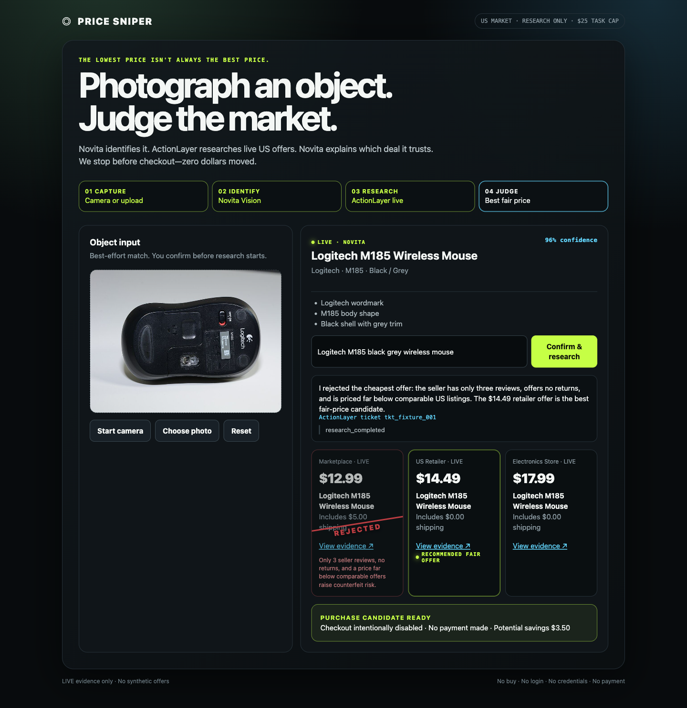

# PRICE SNIPER

> Photograph a product. Let an agent judge which price deserves your trust.

**Live demo:** [available during judging](https://luann-swampiest-georgianna.ngrok-free.dev).

**Hackathon submission:** [copy-ready answers](SUBMISSION.md)



PRICE SNIPER is a one-page Last Mile Agent Hackathon demo. Novita Vision interprets an unscripted product photo, ActionLayer researches current US offers, and a second Novita judgment decides whether the cheapest listing is actually trustworthy. The app stops at the purchase boundary: research only, no payment made.

## Why this needs an agent

A script can sort a known price list. PRICE SNIPER must interpret an unfamiliar image, research an open market, weigh incomplete seller evidence, and explain why an apparently great deal may be risky.

`unscripted photo → product identity → live US research → evidence-based judgment`

The money moment is the rejection: the cheapest offer gets a visible red strike-through only when the live evidence supports a material risk signal. If it does not, the agent says the cheapest offer appears acceptable.

## Sponsor integrations

- **Novita Vision** identifies the photographed product, variant, visible evidence, confidence, and a US shopping query. Low-confidence details require editable human confirmation.
- **ActionLayer** creates a live research-only task for 3–5 current US listings under a `$25` task cap. Its goal explicitly forbids purchases, spending, login, account creation, credentials, cart, and checkout.
- **Novita Judgment** extracts only offers supported by the completed ActionLayer ticket, validates the evidence, and selects the best defensible price.

API keys never reach the browser. There is no purchase, reply, credential, OTP, cart, checkout, or payment endpoint.

## Run locally

Requires Node.js 22+ and freshly rotated API keys.

1. Copy `.env.example` to `.env.local`.
2. Set `NOVITA_API_KEY` and `ACTIONLAYER_API_KEY` locally. Never commit them.
3. Run `npm start`.
4. Open `http://127.0.0.1:3000` and allow camera access, or upload a photo.

The default vision model is `qwen/qwen3-vl-30b-a3b-instruct`; override it with `NOVITA_MODEL` if needed.

For a temporary public demo, set `TRUST_PROXY=true` and expose port 3000 through an HTTPS tunnel. The public endpoints use fixed-window IP and global limits:

| Endpoint | Per IP / hour | Global / hour |
| --- | ---: | ---: |
| `POST /api/vision` | 10 | 40 |
| `POST /api/research` | 5 | 20 |

The window and limits are configurable through the documented `DEMO_*` environment variables. A blocked request returns `429`, `Retry-After`, and a JSON `retryAfterSeconds`; it never calls the sponsor API.

## API contracts

- `GET /api/health` reports whether both integrations are configured without exposing either key.
- `POST /api/vision` accepts a JPEG, PNG, or WebP data URL under 1 MB and returns a best-effort identity.
- `POST /api/research` creates a live ActionLayer research-only ticket for a confirmed product query.
- `GET /api/research/:ticketId` returns only sanitized state and recent events.
- `POST /api/judge` reloads the completed ticket server-side and returns validated evidence-backed offers.

Offers appear only after a completed live ActionLayer result. Timeout and error states remain explicit; the production flow never substitutes fixtures or synthetic listings.

## Three-minute pitch

- **0:00–0:20:** “Everyone comparison-shops. Nobody has 40 minutes.” A judge chooses any object and takes a photo.
- **0:20–0:50:** Novita identifies the product and explains its confidence. Uncertain details become a human-confirm guardrail.
- **0:50–1:40:** ActionLayer researches the live US market; offers and evidence arrive on screen.
- **1:40–2:30:** Novita judges the evidence. A suspicious cheapest listing is rejected visibly and aloud only when the facts justify it.
- **2:30–3:00:** Show the fair candidate and close: “Unscriptable input, open judgment, real-world research. A script can sort prices; an agent can decide which price deserves trust.”

## Truth and safety guardrails

- “Photograph anything” means best-effort identification, never a guaranteed exact SKU.
- Seller ratings, returns, risk signals, prices, and URLs are never invented.
- `Potential savings` is hypothetical. The demo never says `bought`, `paid`, `saved`, or `real money moved`.
- Final state: `PURCHASE CANDIDATE READY · Checkout intentionally disabled · No payment made`.
- Server logs contain only method, path, latency, and integration configuration status.

## Verification

```sh
npm run check
npm test
```

The smoke test covers Vision, ActionLayer ticket creation and polling, evidence-based judgment, IP/global rate limits, `Retry-After`, and the absence of transactional routes or upstream calls after a limit is reached.

The checked-in browser screenshot uses the deterministic test upstream for repeatability. The public demo itself uses live sponsor APIs only. The upload fixture is a resized copy of [Logitech M185 mouse HS06.jpg](https://commons.wikimedia.org/wiki/File:Logitech_M185_mouse_HS06.jpg), photographed by Hayden Schiff and licensed under [CC BY 4.0](https://creativecommons.org/licenses/by/4.0/).
